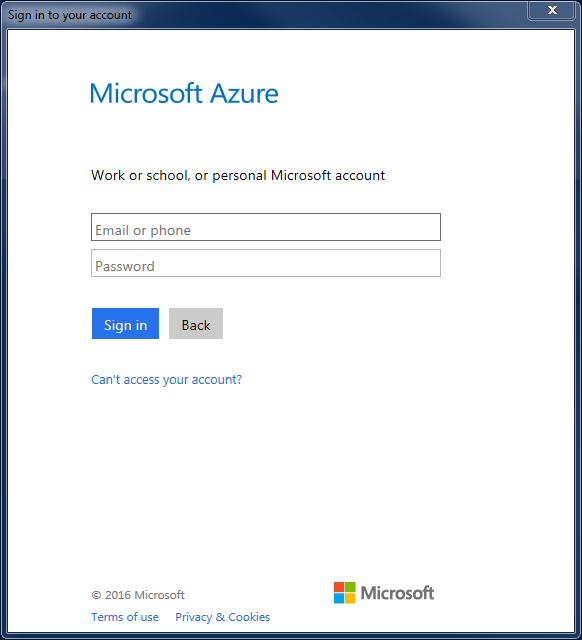
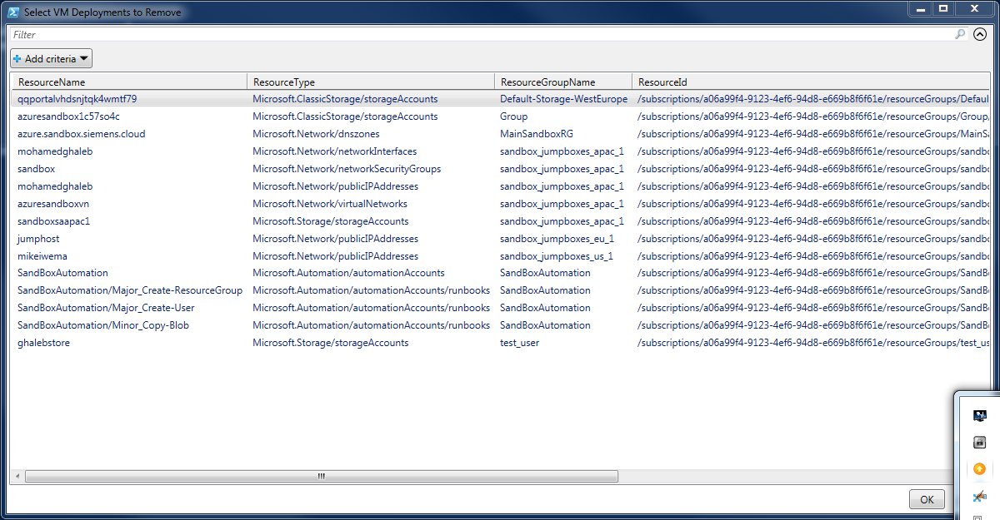

# Azure Resource Cleaner

This script is to make your like easy and save you MONEY ;-)

Have you ever looked around in your Azure Subscription for resources to delete and save cost?
Have you got lost in your portal and forgot to delete some?

Well you are in the right place!

You need to download this script and make sure to install the Azure Powershell, use the link below to download/install it:

https://azure.microsoft.com/en-us/documentation/articles/powershell-install-configure/

After that, run the script:

```powershell
PS D:\> .\azure_clean_resources_v2.ps1
```

If you are not logged in, the script will ask you to login.



You will get then a list of all your resources, use CTRL and choose what you need to remove and click ok.



Found bugs? please mail them to me: mailto:mohamed.ghaleb@siemens.com

Ref. inspired by: https://blogs.technet.microsoft.com/keithmayer/2014/03/26/step-by-step-cleaning-up-the-cloud-with-microsoft-azure-and-windows-powershell/
